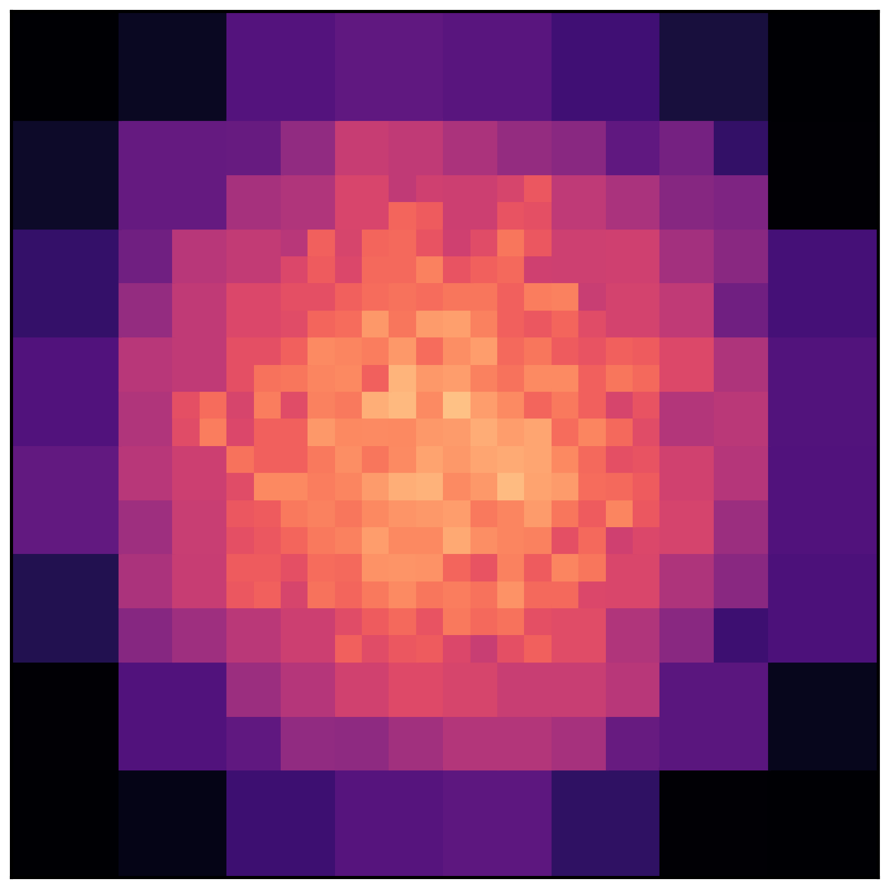

# prj_plotter

[](https://github.com/ybillchen/prj_plotter)
[](LICENSE)
[](https://github.com/ybillchen/prj_plotter/actions/workflows/build.yaml)

Number density projection plotter using quadtree. The core implementation of quadtree is written in C++ for better computational performance. This tool is extremely useful for visualizing particle-based simulations.

The code is open source under an [MIT License](LICENSE), which allows you to redistribute and modify the code with almost no limitations.

## Install

We have tested `prj_plotter` on `python >= 3.6`. However, lower versions may also work. The prerequisites of this package are
```
numpy
matplotlib
pybind11 >= 2.6.0
```
 
Also, make sure a C++ compiler (e.g., GCC, Clang, MSVC, etc.) is properly installed. Your compiler should be up-to-date with the C++11 standard.

To download the package, `git clone` the source code from [GitHub](https://github.com/ybillchen/prj_plotter):
```shell
$ git clone https://github.com/ybillchen/prj_plotter.git
```
Next, `cd` the folder and use `pip` to install it:
```shell
$ cd prj_plotter/
$ pip install -e .
```
The `-e` command allows you to make changes to the Python code. You still need to re-install the package if you changed any of the C++ code.

## Usage

`prj_plotter` is easy to use. You need to first create a `matplotlib.axes.Axes` object, and next pass the `Axes` object and your data to the `prj_plotter.prj` function. Below is an example:
```python
import numpy as np 
import matplotlib.pyplot as plt

import prj_plotter as pp

# Create an Axes object
fig, ax = plt.subplots()

# Example: x and y are from Gaussian distribution
rng = np.random.default_rng(42)
N = 10000
x = rng.normal(0.5, 0.2, N)
y = rng.normal(0.5, 0.2, N)

# make the projection plot
pp.prj(ax, x, y, box=[0.,0.,1.,1.], vmin=3, vmax=5, log=True, 
	capacity=64, max_level=10, cmap=plt.cm.magma)

ax.axes.get_xaxis().set_visible(False)
ax.axes.get_yaxis().set_visible(False)
ax.set_aspect("equal")
plt.show()
```
The variables of the `prj_plotter.prj` function are

* `x` and `y`: coordinates of points.
* `box`: the boundaries of the plotting box in `[left, lower, width, height]`.
* `vmin` and `vmax`: min and max values of the number density, in base-10 logarithmic scale if `log==True`.
* `log`: whether to plot in logarithmic or not. Default to `True`.
* `capacity`: max number of points in a grid. The grid subdivides if exceeding `capacity`. Default to `64`.
* `max_level`: max number of subdivision levels. Default to `10`.
* `cmap`: matplotlib colormap. Default to `matplotlib.pyplot.cm.magma`.

This script gives you something like 
<p align="center"></p>

For comparison, a histogram plot using `matplotlib.Axes.hist2d` leads to

<p align="center"></p>

It is clear that the traditional histogram plot becomes quite chaotic near the edge where the number density is low and the Poisson's error dominates. The `prj_plotter.prj` function ensures that the number of points in each grid is approximately evenly distributed, so that the Poisson's error is under control.


## Contribute

Feel free to dive in! [Raise an issue](https://github.com/ybillchen/prj_plotter/issues/new) or submit pull requests. We recommend you to contribute code to `prj_plotter` following [GitHub flow](https://docs.github.com/en/get-started/quickstart/github-flow). 

## Maintainers

- [@ybillchen (Bill Chen)](https://github.com/ybillchen)
